# E-Commerce Backend (AWS Serverless Architecture)

This project implements a complete backend for an e-commerce platform using AWS serverless technologies. It includes user registration, product management, and order placement via REST APIs. The architecture is deployed using Terraform (for core infrastructure) and the Serverless Framework (for function deployment).

## Features

- RESTful APIs for Users, Products, and Orders
- Serverless architecture using AWS Lambda, API Gateway, and DynamoDB
- User authentication via Amazon Cognito
- Infrastructure provisioned via Terraform
- CI/CD pipeline with GitHub Actions for automated deployments
- Centralized logging and monitoring using CloudWatch
- Optional product image/file storage with Amazon S3

## Architecture Overview

| Component            | Service Used         |
|----------------------|----------------------|
| API Gateway          | HTTP interface       |
| AWS Lambda           | Function execution   |
| DynamoDB             | NoSQL storage        |
| Amazon Cognito       | Authentication       |
| S3 (optional)        | File/image storage   |
| CloudWatch           | Logs and monitoring  |
| Terraform            | Infrastructure setup |
| Serverless Framework | Lambda deployment    |
| GitHub Actions       | CI/CD pipeline       |

## Screenshots

### API Gateway Configuration
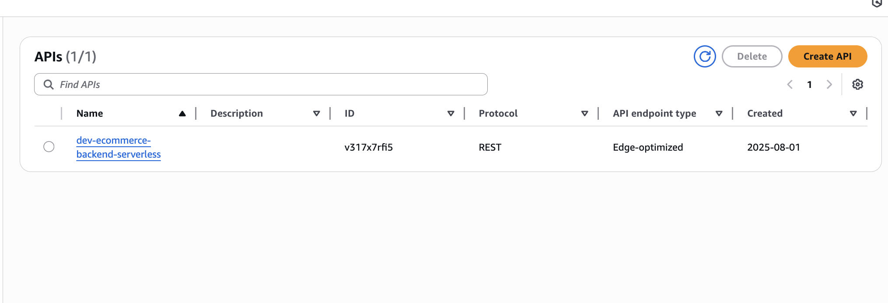

### Lambda Function Deployments
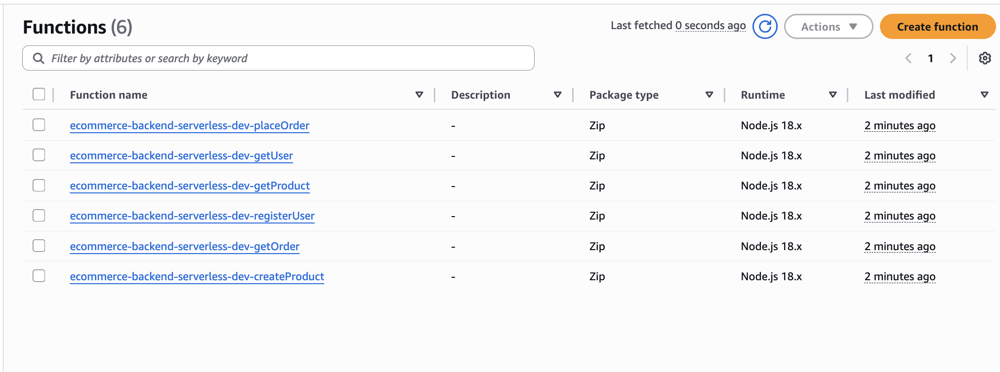

### DynamoDB Tables
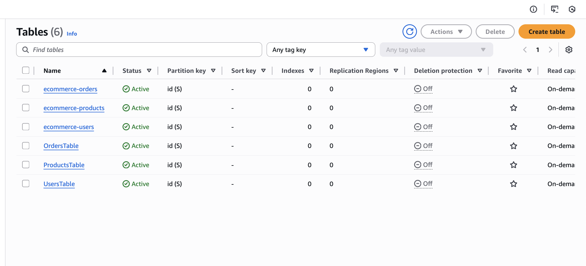

### CloudFormation Stack
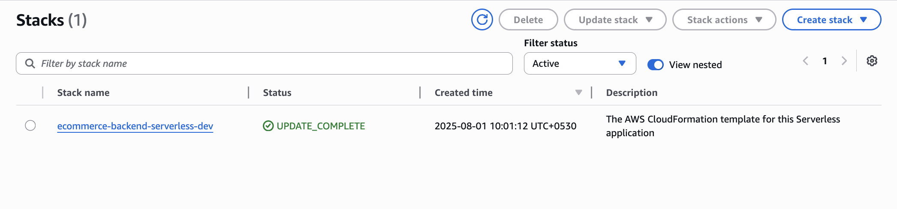

### Sample cURL Tests

**Register User**  
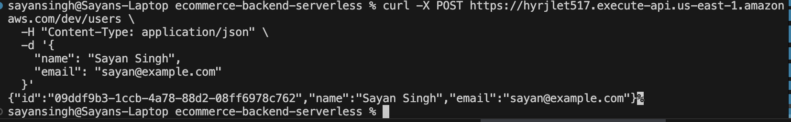

**Create Product**  
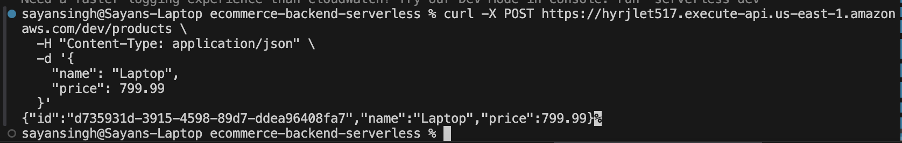

**Place Order**  
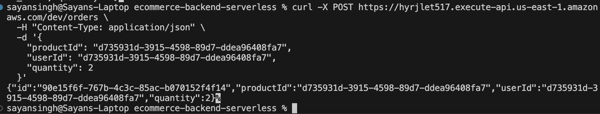

**Get User**  
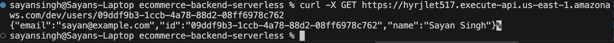

**Get Product**  


**Get Order**  
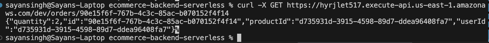

**Users Table View**  
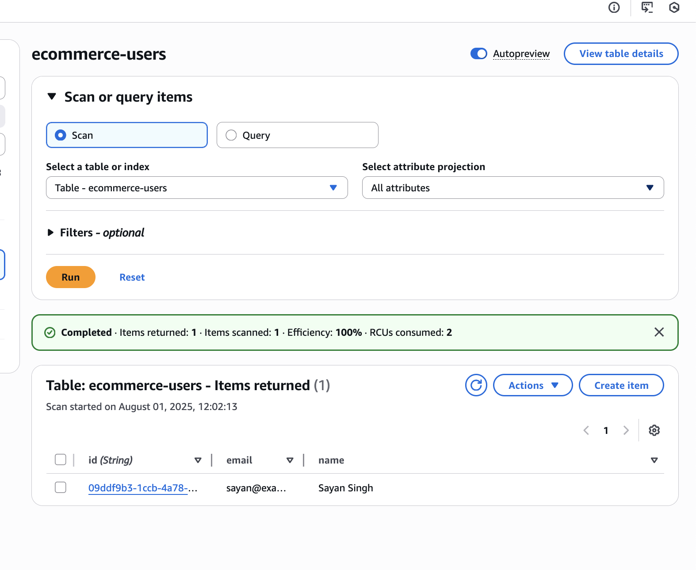

**Products Table View**  
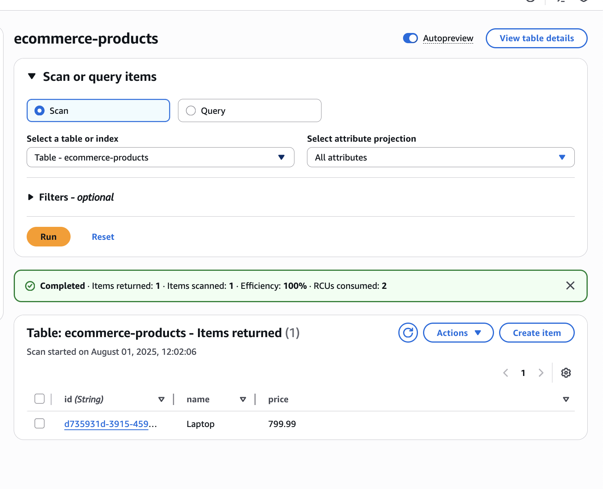

**Orders Table View**  
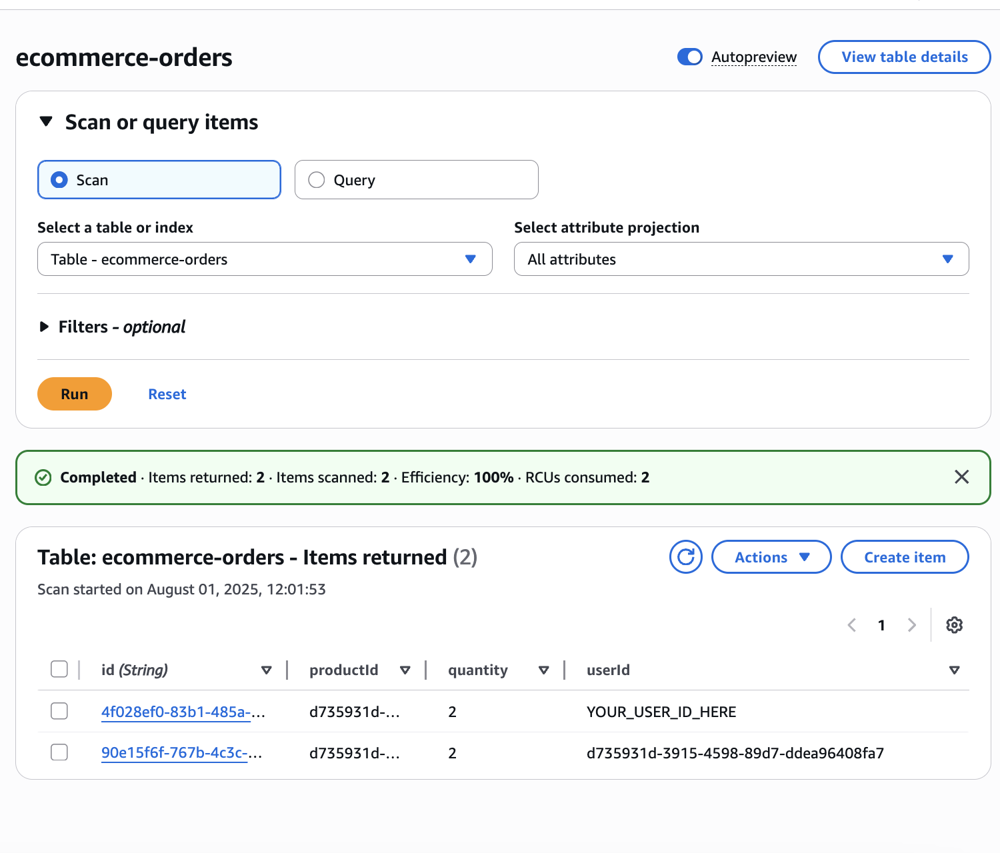


## Getting Started

### Prerequisites

- Node.js and npm
- Terraform CLI
- AWS CLI (configured with credentials)
- Serverless Framework installed globally  
  ```bash
  npm install -g serverless
  ```

### Folder Structure

- `/terraform`: Contains Terraform files for setting up infrastructure
- `/services`: Contains Serverless services and Lambda functions

---

## Deployment Instructions

### 1. Provision Infrastructure with Terraform

Navigate to the `terraform` folder and run:

```bash
cd terraform
terraform init
terraform apply
```

This will create:

- DynamoDB tables
- Cognito User Pool
- API Gateway and supporting resources (if defined in Terraform)

### 2. Deploy Lambda Functions with Serverless Framework

Navigate to the Serverless function folder (e.g., `services/`) and run:

```bash
npx serverless deploy
```

This will deploy all Lambda functions defined in `serverless.yml` and hook them to API Gateway.

---

## Teardown / Cleanup

To clean up all resources:

### 1. Remove Serverless Stack
```bash
npx serverless remove
```

### 2. Destroy Terraform Infrastructure
```bash
cd terraform
terraform destroy
```

---

## Deploying with GitHub Actions

GitHub Actions is set up to automatically deploy the backend on push to the `main` branch.

To trigger:

1. Push code changes to `main`:
   ```bash
   git push origin main
   ```

2. GitHub Actions will:
   - Run Terraform (optional, if you define it in `.github/workflows`)
   - Run `npx serverless deploy`
   - Deploy latest code to AWS

Make sure your GitHub repo is configured with the correct AWS credentials via GitHub Secrets (`AWS_ACCESS_KEY_ID`, `AWS_SECRET_ACCESS_KEY`, etc.).

---

## API Testing

You can test the endpoints using cURL or Postman. Example cURL commands are provided in the `curl-*.png` screenshots above.

---

## License

This project is licensed under the MIT License.
